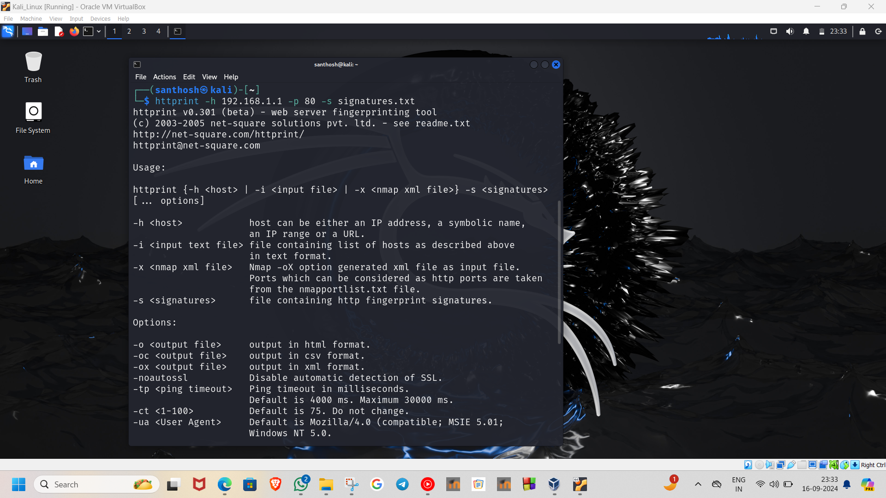

# InformationGathering
Information Gathering Techiques
## NAME: SANTHOSH T
## REGISTER NO: 212223220100
## DEPARTMENT: INFORMATION TECHNOLOGY

# To perform information gathering techniques

# AIM:

To perform information gathering techniques using kali linux 

## STEPS:

### Step 1:

Install kali linux either in partition or virtual box or in live mode

### Step 2:

Investigate on the various categories of tools as follows:

### Step 3:
Open terminal/browser and try execute necessary commands/use url to perform information gathering

## OUTPUT:

### WHOIS

### IP2LOCATION

### WEB ARCHIVE

## WEB SERVER FINGERPRINTING
### NMAP

### NET CAT

### WHATWEB

### HTTPRINT

### PING

### TCP TRACEROUTE

### ICMP TRACEROUTE

### UDP TRACEROUTE

## RESULT:
The information gathering techniques tools/procedure were  identified successfully
